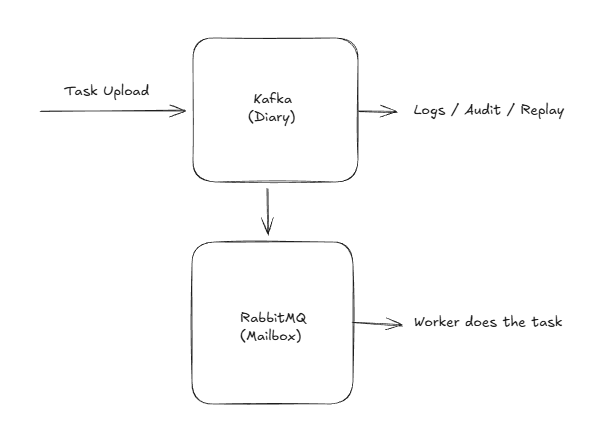

# Task Processing System with Kafka and RabbitMQ

## Overview

This project explores and implements a **task processing architecture** that deliberately separates **history** from **execution**.

The system is designed to:

* Record **every task and its lifecycle** as immutable events
* Ensure **tasks are executed exactly once** by workers
* Allow **replay, auditing, debugging, and recovery**
* Be implemented using **NestJS** with clear architectural boundaries

This is not just an implementation exercise. The primary goal is to **deeply understand event-driven systems**, message brokers, and failure-resilient design.

---

## Core Idea

The system uses **two messaging systems**, each with a single, well-defined responsibility:

* **Kafka** → System of record ("diary")

  * Stores all task-related events
  * Enables replay and auditing
  * Represents the source of truth

* **RabbitMQ** → System of execution ("work queue")

  * Distributes tasks to workers
  * Ensures tasks are processed once
  * Handles retries and acknowledgements

**NestJS acts as the glue**, orchestrating communication without owning state or history.

---

## Conceptual Flow

1. A task is created by a client or service
2. The task creation is recorded as an event in Kafka
3. The task is dispatched to RabbitMQ for execution
4. A worker consumes the task and processes it
5. Task progress and completion are recorded back to Kafka

Kafka always knows **what happened**.
RabbitMQ ensures **work gets done**.

---

## Architectural Principles

* **Single Responsibility**: Kafka remembers, RabbitMQ executes
* **Immutability**: Events are facts, never commands
* **Loose Coupling**: Execution does not depend on history storage
* **Failure Tolerance**: Any component can fail without losing truth
* **Replayability**: Past events can be reprocessed safely

---

## Milestones

### Milestone 1 — Mental Model & Domain Definition

**Goal:** Understand the problem before touching infrastructure.

Tasks:

* Define what a *task* is vs what an *event* is
  * task:
    * A unit of intent
    * With an identity
    * That may or may not ever be executed
  * event:
    * Immutable
    * True forever
    * Observable after the fact
* Write the lifecycle of a task from creation to completion
  * The system accepted a task → ✅ Event
  * Task persistence was confirmed → ✅ Event
  * Task was made available for execution → ✅ Event
  * Worker X claimed task Y at time T → ✅ Event
  * Worker completed/failed processing → ✅ Event
  * Facts (Events)
    * Task accepted
    * Task persisted
    * Task made available for execution
    * Task claimed by worker X
    * Task completed
    * Task failed
  * Actions (Commands / Intent)
    * Send task
    * Retry task
    * Dispatch task
    * Process task
  * 🔑 Rule you now own:
    * Actions cause events. Events describe reality
* Identify which steps are facts and which are actions
* Define success, failure, and retry in plain language
  * Success: Success is stage-specific, not global.
    * it succeeded if a task processing success and task dispatch success
    * There are actually multiple successes:
      * Task accepted
      * Task recorded
      * Task dispatched
      * Task processed
    * A task can be successfully recorded and still fail execution.
  * Failure: Failure is also stage-specific.
    * A failure at any stage must be recorded as an event.
    * Failures can be transient (e.g., worker crash) or permanent (e.g., invalid task).
    * a task is received but not added to queue or diary is a system failure.
  * Retry: Retries are actions taken to recover from failures.
    * the task is received and added to diary but no to queue can be added later
      * Same task
      * New attempt
      * New event
    * 🔑 History grows. The task identity does not change.
    * Retry never rewrites the past.

Deliverable:

* Written domain definitions and task lifecycle notes

---

### Milestone 2 — Event Design (Kafka)

**Goal:** Treat Kafka as the source of truth.

Tasks:

* Define Kafka topics and what each represents
* Decide which events are emitted and when
* Define event immutability and ordering expectations
* Decide retention and replay strategies

Deliverable:

* Event taxonomy and topic design document

## Purpose

This milestone focuses on designing **domain events** that represent immutable facts about the system.

The goal is to ensure that:

* Events are **replay-safe**
* Events describe **what happened**, not what should happen
* Kafka is treated as a **stream of truth**, not a queue

No implementation details or code should be added at this stage.

---

## Objective

By completing this milestone, you should be able to:

* Decide what deserves to be an event
* Define a stable set of domain events
* Design events that remain correct when replayed
* Explain your Kafka topic strategy confidently

---

## Task 2.1 — Event Eligibility

For each statement below, mark **YES** or **NO** and explain why.

| Statement                           | Event? (YES/NO) | Reason |
| ----------------------------------- | --------------- | ------ |
| A task was accepted                 | YES             | A task was accepted |
| A task was validated                | YES             | A task was validated |
| A task was sent to execution        | YES             | A task was sent to execution |
| A worker started processing a task  | YES             | A worker started processing a task |
| A worker finished processing a task | YES             | A worker finished processing a task |
| A retry was scheduled               | YES             | A retry was scheduled |
| A retry happened                    | YES             | A retry happened |
| A task is currently being processed | NO              | A task is currently being processed, and that is already covered by a worker started the process |
| A task was rejected                 | YES             | A task was rejected |

---

## Task 2.2 — Core Event Types

List the **core domain events** for the system.

Rules:

* Use past tense
* Avoid infrastructure or technology names
* Events must represent facts

## Proposed events:

* TaskAccepted
* TaskRejected
* TaskExecutionStarted
* TaskExecutionCompleted
* TaskExecutionFailed
* TaskRetryScheduled
* TaskDispatched

(5–8 total events recommended)

---

## Task 2.3 — Event Payload Reasoning

For each event, describe what information it must carry.

For each event, answer:

* What identity does it reference?
* What timestamp is required?
* What context is required to understand it in isolation?
* What must **never** be included?

Use the following template per event:

### Event: `<EventName>`

* TaskAccepted
  * Identity: Event
  * Timestamp: When the task was accepted by the system
  * Required context: Task details (e.g., task ID, type, payload)
  * Must NOT include: Any sensitive information or execution results

* TaskRejected
  * Identity: Event
  * Timestamp: When the task was rejected
  * Required context: Reason for rejection, task details
  * Must NOT include: Any sensitive information

* TaskExecutionStarted
  * Identity: Event
  * Timestamp: When the worker started processing the task
  * Required context: Worker ID, task details (Task ID, type, payload)
  * Must NOT include: Any sensitive information or execution results

* TaskExecutionCompleted
  * Identity: Event
  * Timestamp: When the worker completed processing the task
  * Required context: Worker ID, task details, execution results
  * Must NOT include: Any sensitive information

* TaskExecutionFailed
  * Identity: Event
  * Timestamp: When the worker failed processing the task
  * Required context: Worker ID, task details, error details
  * Must NOT include: Any sensitive information

* TaskRetry
  * Identity: Event
  * Timestamp: When the retry was initiated
  * Required context: Task details, reason for retry
  * Must NOT include: Any sensitive information

* TaskDispatched
  * Identity: Event
  * Timestamp: When the task was dispatched to RabbitMQ
  * Required context: Task details
  * Must NOT include: Any sensitive information

---

## Task 2.4 — Topic Strategy

Describe how Kafka topics are organized.

Answer:

* Single topic or multiple topics?
  * ONE topic for the task lifecycle
  * Rationale: Simplicity, easier to replay all events related to tasks
* What does one topic represent?
  * The lifecycle of tasks from acceptance to completion or failure
* Is the split based on domain, lifecycle stage, or entity?
  * domain

---

## Task 2.5 — Ordering & Identity

Describe ordering expectations.

Answer:

* What events must be ordered?
  * Events related to the same task must be ordered (e.g., TaskAccepted before TaskDispatched)
* What events can arrive out of order?
  * Events related to different tasks can arrive out of order
* What is the event key and why?
  * The event key is the Task ID, ensuring all events for a specific task are routed to the same partition for ordering

---

## Task 2.6 — Replay Safety Analysis

Assume:

* All events are replayed from day one
* All consumers restart

Answer:

* What should happen during replay?
  * Task states are reconstructed
  * Metrics are recalculated
  * Dashboards rebuild
  * Audits become available
* What must NOT happen during replay?
  * Tasks are re-executed
  * Messages are re-enqueued
  * Workers suddenly start processing old tasks
  * Users receive duplicate notifications
* Which events are dangerous if designed incorrectly?
  * in this case none, as long as we separate execution from history
  * Events that trigger side effects (e.g., TaskDispatched) must be handled carefully to avoid re-execution
  * commands, not facts. Replaying them repeats actions.

---

### Milestone 3 — Task Execution Design (RabbitMQ)

**Goal:** Ensure reliable and scalable task execution.

Tasks:

* Define what a job contains vs what stays in Kafka
  * A job contains only minimal execution data:
    * Task identifier (taskId)
    * Attempt number
    * Minimal execution parameters
    * Routing or priority metadata (optional)
    * Nothing historical
    * Nothing authoritative
    * A job represents work to be done, not truth.
  * Dairy (Kafka) contains:
    * Full task details
    * Complete history of events
    * Execution results
    * Audit trails
    * Truth about what happened
    * Execution failure
    * Retry scheduling
    * Permanent failure
  * Kafka holds facts.
  * RabbitMQ holds instructions.
* Design queue topology (single vs multiple queues)
  * Initial design: Single execution queue
  * Rationale:
    * Simpler mental model
    * Easier to reason about correctness
    * All workers consume from the same queue
    * Scaling achieved by adding workers, not queues
  * Future evolution (explicitly allowed):
    * Multiple queues by task type or priority
    * Dedicated queues for long-running or heavy tasks
    * Still one Kafka topic for lifecycle events
  * Queue topology affects throughput, not truth.
* Define worker responsibilities and boundaries
  * Worker responsibilities:
    * Consume jobs from RabbitMQ
    * Execute the task
    * Emit events to Kafka
    * Acknowledge or reject the job
  * Worker boundaries (must NOT do):
    * Must not store task history
    * Must not decide task truth
    * Must not modify or delete past events
    * Must not read Kafka to decide execution
  * Workers **produce events**, they do not interpret history.
  * Kafka remains the single source of truth.
* Define acknowledgement, retry, and dead-letter rules
  
  * Acknowledgement rules:
    * ACK only after:
      * Execution result is known
      * Corresponding event is successfully written to Kafka
    * Never ACK before recording the outcome
    * If a worker crashes before ACK:
      * RabbitMQ re-queues the job
      * Another worker may retry
      * History remains correct
  
  ---
  
  * Retry rules:
  * Retries are explicit and recorded as events
  * A retry:
    * Uses the same taskId
    * Increments the attempt number
    * Produces new lifecycle events
  * Retries never overwrite past failures
  * Retry decisions are policy-driven, not implicit.
  
  ---
  
  * Dead-letter rules:
    * After retry limits are exceeded:
      * Emit a permanent failure event
      * Stop dispatching the task
    * Dead-letter queues are operational tools
    * Kafka remains the authoritative history
  * Failure is not silence.
  * Failure is a recorded fact.

Deliverable:

* Execution flow and failure-handling design

---

### Milestone 4 — NestJS Architecture

**Goal:** Enforce clean boundaries in the application.

Tasks:

* Define NestJS modules and their responsibilities
* Decide which modules produce or consume events
* Identify forbidden dependencies between modules
* Decide which logic belongs outside NestJS

Deliverable:

* High-level module and dependency diagram

* Define NestJS modules and their responsibilities
  * Task API Module
    * Accepts task creation requests
    * Validates input and business rules
    * Emits TaskAccepted events
    * Does not enqueue jobs or execute tasks
  * Event Producer Module
    * Responsible for publishing events to Kafka
    * Guarantees event schema and ordering (by taskId)
    * Used by API and workers
    * Contains no business logic
  * Diary / Event Consumer Module
    * Consumes Kafka events
    * Builds projections (task status, history, metrics)
    * Stores derived state
    * Must be fully replayable
  * Dispatch Module
    * Observes task lifecycle via Kafka
    * Decides when a task should be dispatched
    * Sends execution commands to RabbitMQ
    * Enforces idempotency (dispatch once per attempt)
  * Worker Module
    * Consumes jobs from RabbitMQ
    * Executes tasks
    * Emits execution events to Kafka
    * Acknowledges or rejects jobs

---

* Decide which modules produce or consume events
  * Produce events to Kafka
    * Task API Module
    * Worker Module
    * Dispatch Module (for dispatch-related facts)
  * Consume events from Kafka
    * Diary / Event Consumer Module
    * Dispatch Module (read-only decision making)
  * Consume messages from RabbitMQ
    * Worker Module only

---

* Identify forbidden dependencies between modules
  * Task API Module must not depend on:
    * RabbitMQ
    * Worker logic
    * Projections or read models
  * Worker Module must not depend on:
    * Kafka consumers or projections
    * Task API logic
    * Other workers
  * Diary / Event Consumer Module must not:
    * Produce commands
    * Trigger side effects
    * Call RabbitMQ
  * Dispatch Module must not:
    * Execute tasks
    * Modify projections directly

---

Decide which logic belongs outside NestJS
Kafka brokers and RabbitMQ infrastructure
Task execution logic (business work)
Message retry policies and broker-level guarantees
Operational concerns (scaling, deployment, monitoring)
NestJS is responsible for:
Orchestration
Boundary enforcement
Event flow coordination

---

### Milestone 5 — Failure Scenarios & Resilience

**Goal:** Design for failure, not success.

Tasks:

* Simulate Kafka failures, RabbitMQ failures, and worker crashes
* Define system behavior under partial outages
* Define idempotency rules and duplicate handling
* Validate that replay does not cause corruption

Deliverable:

* Failure scenario matrix with expected outcomes

---

* Simulate Kafka failures, RabbitMQ failures, and worker crashes
  * Kafka unavailable
    * Task API must reject task creation
    * No task is accepted without being recorded
    * Workers must not acknowledge jobs if events cannot be written
    * System prefers rejection over silent loss
  * RabbitMQ unavailable
    * Task acceptance still succeeds
    * Task is recorded in Kafka only
    * Dispatch is deferred and retried later
    * No task execution occurs without queue confirmation
  * Worker crash before ACK
    * RabbitMQ re-queues the job
    * Another worker may pick it up
    * Duplicate execution is possible
    * History reflects all attempts
  * Worker crash after ACK but before completion
    * Task remains incomplete
    * No completion event exists
    * Monitoring detects a stuck execution

---

* **Define system behavior under partial outages**
  * Kafka down → system becomes read-only or rejects writes
  * RabbitMQ down → system continues recording intent
  * Workers down → backlog grows, no data loss
  * Projections down → execution continues, visibility degraded
* The system sacrifices availability before correctness.

---

* **Define idempotency rules and duplicate handling**
  * Event producers must use deterministic keys (taskId)
  * Consumers must tolerate duplicate events
  * Dispatch logic must ensure:
    * One dispatch per task attempt
    * Safe reprocessing on restart
  * Workers must treat tasks as idempotent or externally protected
  * Duplicates are allowed. Corruption is not.

---

* **Validate that replay does not cause corruption**
  * Replaying Kafka events:
    * Rebuilds projections
    * Recomputes metrics
    * Does not enqueue jobs
    * Does not execute tasks
  * Any side effect on replay is a design violation
  * Replay must be safe, repeatable, and deterministic.

---

### Milestone 6 — Observability & Trust

**Goal:** Be able to explain and prove system behavior.

Tasks:

* Define what questions the system must answer
* Identify critical metrics and signals
* Decide how task state is reconstructed from events

Deliverable:

* Observability and auditing requirements document

---

* **Define what questions the system must answer**
  * What is the current state of a given task?
  * When was the task accepted, dispatched, started, retried, completed, or failed?
  * Which worker handled each execution attempt?
  * How many attempts has a task had, and why?
  * Are there tasks stuck in a particular state?
  * What failures are happening most often?
  * How long do tasks take end-to-end?
  * Did the system behave correctly during an outage?

---

* **Identify critical metrics and signals**
  * Task acceptance rate
  * Dispatch latency (accepted → dispatched)
  * Execution latency (dispatched → completed/failed)
  * Success vs failure rate
  * Retry count per task
  * Permanently failed task count
  * Worker throughput and failure rate
  * Tasks without terminal events after a threshold
  * Event production and consumption lag
  * All metrics must be derived from Kafka events, not queue depth alone.

---

* **Decide how task state is reconstructed from events**
  * Task state is not stored directly
  * State is derived by replaying events in order per taskId
  * Each event transitions the task to a new derived state
  * Conflicting or unexpected sequences are preserved, not hidden
  * Projections represent the latest known state
  * Projections can be deleted and rebuilt at any time
  * Truth is reconstructed, not assumed.

---

### Milestone 7 — Implementation Readiness

**Goal:** Be confident before writing code.

Tasks:

* Map concepts to NestJS constructs
* Decide deployment and scaling strategy
* Confirm separation of concerns is enforced

Deliverable:

* Final implementation plan

---

* Map concepts to NestJS constructs
  * Modules
    * Task API → Controller + Application Service
    * Event production → Dedicated Kafka producer service
    * Event consumption → Kafka consumer modules per projection
    * Dispatch logic → Stateless application service triggered by events
    * Worker → Separate NestJS application or standalone service
  * Providers
    * Event publishers
    * Projection builders
    * Idempotency guards
    * Policy evaluators (retry, dispatch rules)
  * Boundaries
    * Controllers handle input only
    * Services coordinate actions
    * No business rules in infrastructure adapters

---

* **Decide deployment and scaling strategy**
  * Separate deployables for:
    * API / Event producer
    * Dispatch service
    * Worker service
    * Projection/Read-model service
  * Scale API by request load
  * Scale workers independently by queue depth
  * Scale consumers by Kafka partitions
  * Treat Kafka and RabbitMQ as shared infrastructure
  * Scaling is horizontal and role-based, not monolithic.

---

* **Confirm separation of concerns is enforced**
  * Kafka is the system of record
  * RabbitMQ is execution only
  * NestJS coordinates, not owns, business truth
  * Workers do not read history
  * Projections do not cause side effects
  * Replay remains safe under all conditions
* If any component is removed:
  * History remains intact
  * The system can recover

---

## Success Criteria

The project is successful when:

* No task is lost, even during failures
* Tasks can be replayed safely
* Execution and history are clearly separated
* The architecture can be explained without mentioning code

---

## Final Note

This project prioritizes **understanding over speed**.

If the system feels simple after implementation, that is a sign the design was correct.
